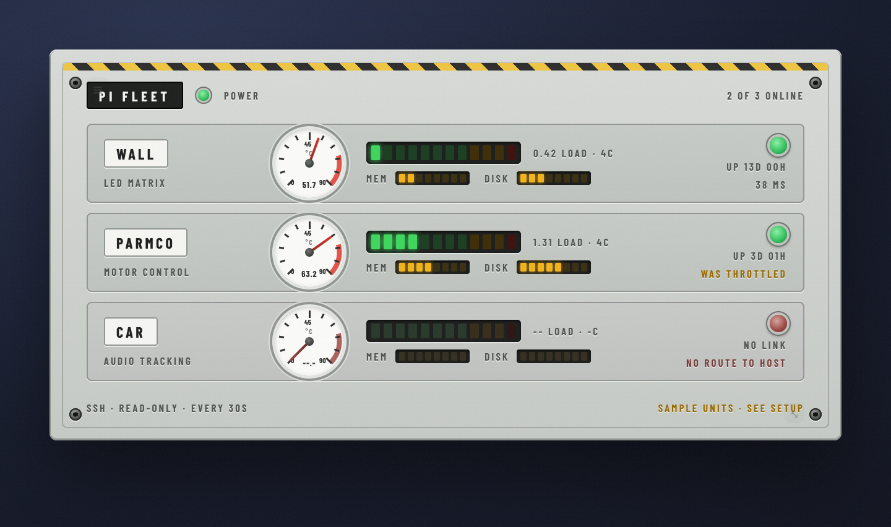

# pi-fleet

> Your Raspberry Pis on an industrial control cabinet: reachability, temperature gauges, load, memory, disk, uptime, and throttling.

[](https://github.com/jke48222/pi-fleet-widget/releases/latest) [](LICENSE) 

[Übersicht gallery](https://tracesof.net/uebersicht-widgets/) · [Widget suite](https://github.com/jke48222/widget-suite) · [Download](https://github.com/jke48222/pi-fleet-widget/releases/latest) · [Setup guide](docs/SETUP.md) · [Troubleshooting](docs/TROUBLESHOOTING.md)

A widget for [Übersicht](http://tracesof.net/uebersicht/), self-contained in
`index.jsx`. It is an industrial control cabinet: a light-grey (RAL 7035)
enclosure with a hazard stripe and hex screws, one sub-panel per Pi, each with
an engraved traffolyte name label, an analog temperature gauge with a red zone,
an LED bargraph for load, LED strips for memory and disk, a chrome pilot lamp,
and engraved uptime. Every refresh it opens an SSH connection to each Pi in parallel
(key auth, `BatchMode`, four-second connect timeout) and sends a read-only shell
snippet over stdin that reports the SoC temperature, load averages, memory,
root disk, uptime, model, and `vcgencmd get_throttled`. Each host becomes a
tile with a temperature gauge, a load sparkline kept across refreshes, memory
and disk bars, and a throttling flag when the Pi has been starved of power or
heat-limited. With no config it shows labeled sample data.



## Requirements

- macOS with [Übersicht](https://tracesof.net/uebersicht/) installed (`brew install --cask ubersicht`)
- `python3` on the PATH
- SSH key access to each Pi (`ssh-copy-id pi@<host>`); the probe never prompts
- Raspberry Pi OS or any Linux on the hosts; `vcgencmd` is optional

## Install

If you don't have Übersicht yet:

```sh
brew install --cask ubersicht
```

**One-click.** Clone the repo and run the installer. It copies the widget into Übersicht's widgets folder, installs any helper scripts, and runs setup if the widget needs it. Safe to re-run.

```sh
git clone https://github.com/jke48222/pi-fleet-widget.git
cd pi-fleet-widget && ./install.sh
```

**Manual.** Download `pi-fleet.widget.zip` from the [latest release](https://github.com/jke48222/pi-fleet-widget/releases/latest), unzip it, and put the `pi-fleet.widget` folder in `~/Library/Application Support/Übersicht/widgets/`. Then refresh Übersicht (menu bar icon → Refresh All).

Blank widget? Run `./check.sh` for a pass/fail diagnosis, or see [docs/TROUBLESHOOTING.md](docs/TROUBLESHOOTING.md).

## Configuration

`install.sh` writes `~/.config/widgetsuite/pi-fleet.json` from the example in
`setup/`. Edit the hosts:

```json
{
  "interval": 30,
  "hosts": [
    { "name": "wall",   "role": "LED matrix",     "host": "wall.local",   "user": "pi" },
    { "name": "parmco", "role": "motor control",  "host": "parmco.local", "user": "pi" },
    { "name": "car",    "role": "audio tracking", "host": "car.local",    "user": "pi", "port": 22 }
  ]
}
```

Then refresh Übersicht. Up to six hosts fit; with more than three the card
grows to two rows on the next reload.

## What the probe reads

`/proc/uptime`, `/proc/loadavg`, `/proc/meminfo`, `df -Pk /`,
`/sys/class/thermal/thermal_zone0/temp`, `/proc/device-tree/model`, `nproc`,
`hostname -I`, and `vcgencmd get_throttled`. Nothing is written to the Pi and
nothing is installed there. The throttling flag decodes the `get_throttled`
bits: **throttled** means under-voltage, frequency capping, or the soft
temperature limit is active right now; **was throttled** means it happened
since boot.

## Customization

- `interval` in the config sets the refresh; the widget's `refreshFrequency` is the default 30 s.
- The gauge's red zone starts at 70 °C (the `conic-gradient` in `.gauge .zone` in `index.jsx`).
- `setup/pi-fleet.py` is the same helper as a file: `python3 setup/pi-fleet.py | python3 -m json.tool` shows exactly what the widget sees.
- All visual styling is in the inlined design-system block at the top of `index.jsx`.

## Bundled files

- `pi-fleet.widget/index.jsx` — the widget, helper embedded
- `pi-fleet.widget/fonts/` — Barlow Condensed; SIL Open Font License, see `fonts/OFL.txt`
- `setup/pi-fleet.py` — the same helper as a file
- `setup/pi-fleet.example.json` — a starting config
- `setup/configure.sh` — writes the config on install if none exists
- `install.sh` / `install.command` — one-click installer (copies the widget into Übersicht and installs any helpers)
- `check.sh` — read-only setup diagnostics; prints pass/fail per item

## Related widgets

Part of the [Übersicht Widget Suite](https://github.com/jke48222/widget-suite): 16 widgets that share one design system.

- [Animated Wallpaper](https://github.com/jke48222/animated-wallpaper-widget)
- [Clipboard History](https://github.com/jke48222/clipboard-history-widget)
- [Daily AI Prompt](https://github.com/jke48222/daily-ai-prompt-widget)
- [Daily Astronomy Photo](https://github.com/jke48222/daily-astronomy-photo-widget)
- [Daily Tarot](https://github.com/jke48222/daily-tarot-widget)
- [GitHub Contributions](https://github.com/jke48222/github-contributions-widget)
- [Now Playing](https://github.com/jke48222/now-playing-widget)
- [Recent Album Covers](https://github.com/jke48222/recent-album-covers-widget)
- [Recent Downloads](https://github.com/jke48222/recent-downloads-widget)
- [Rotating 3D Model](https://github.com/jke48222/rotating-3d-model-widget)
- [Spinning Globe](https://github.com/jke48222/spinning-globe-widget)
- [Wallpaper Switcher](https://github.com/jke48222/wallpaper-switcher-widget)
- [Keys & Pads](https://github.com/jke48222/keys-and-pads-widget)
- [Agent Fleet](https://github.com/jke48222/agent-fleet-widget)
- [Window Pet](https://github.com/jke48222/window-pet-widget)

## License

MIT. See [LICENSE](LICENSE).

## Author

Jalen Edusei <jalen.edusei@gmail.com>
